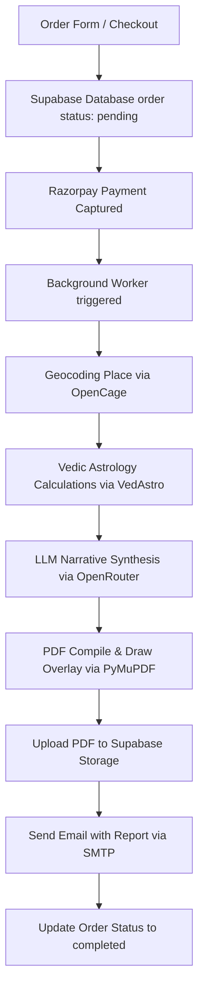

# Astrology Report Engine Custom Skill

This skill coordinates the generation of Vedic Compatibility & Marriage Reports, tying together database state management, astronomical computation, AI-driven narrative synthesis, PDF rendering, and email distribution.

## Core Workflows

## Service Configurations & API Parameters

### 1. Geocoding Service (`GeocodingService`)
- **API Target**: OpenCage Geocoding API (`https://api.opencagedata.com/geocode/v1/json`)
- **Key**: `OPENCAGE_API_KEY`
- **Output**: Returns longitude, latitude, and timezone (IANA format) for the birth location.

### 2. Vedic Astrology API (`VedAstroService`)
- **API Target**: `https://api.vedastro.org/api`
- **Key**: `VEDASTRO_API_KEY` (defaults to `FreeAPIUser` if none is configured)
- **Functions Used**:
  - `get_all_planet_data`: Retrives D1 placements.
  - `get_all_house_rasi_signs`: Retrieves D1 house placements.
  - `get_all_planet_navamsha_signs`: Navamsha D9 sign mappings.
  - `get_all_planet_trimshamsha_signs`: Trimshamsha D30 sign mappings.
  - `get_kuja_dosha_score`: Returns Mars affliction status.
  - `get_dasa_for_now`: Retrieves active Major/Sub/SubSub Dashas.
  - `get_dasa_at_range`: Projects Dasha timeline over a 10-year period.
- **Caching**: Employs a local cache database at `.cache/` via `FileCache` to prevent redundant API queries.

### 3. LLM Router Service (`LLMRouter`)
- **API Target**: OpenRouter API (`https://openrouter.ai/api/v1`)
- **Key**: `OPENROUTER_API_KEY`
- **Model**: `OPENROUTER_MODEL` (default: `openai/gpt-5.4-mini` or similar)
- **Output**: Formatted markdown text with interpretation nodes that are clean of standard thinking blocks.

### 4. PDF Compilation Service (`PDFService`)
- **Template Base**: `Blank Report Revised.pdf`
- **Engine**: PyMuPDF (`fitz`) overlay logic.
- **Draw Mechanics**:
  - Absolute coordinate tables and text wrapping based on font files loaded from `fonts/` directory.
  - Generates custom elements: circular charts, divisional placement tables, and risk metrics grids.

### 5. Supabase Storage & Database (`SupabaseService`)
- **DB Connection**: Supabase SDK wrapper.
- **Tables**: `customers`, `orders`, `payments`, `email_logs`, and `admin_users`.
- **Storage Bucket**: `reports` (stores generated PDFs, returning public URLs).

### 6. Email Service (`EmailService`)
- **Provider**: SendPulse SMTP (`smtp-pulse.com` on port 465/587).
- **Credentials**: `SENDPULSE_SMTP_USER` and `SENDPULSE_SMTP_PASSWORD`.
- **Emails Sent**: Immediate delivery confirmations and completed astrology PDF attachments.

## DB Schema Reference
- **Customers**: Linked by email/mobile to orders.
- **Orders**: Tracks birth date, time, location, geo-coordinates, order status (`pending`, `paid`, `processing`, `completed`), and PDF report URL.
- **Payments**: Razorpay Order ID to transaction confirmation mappings.
- **Email Logs**: SMTP success/fail logs for orders.
- **Admin Users**: Authorized emails with status `approved` allowed to access admin control panels.
